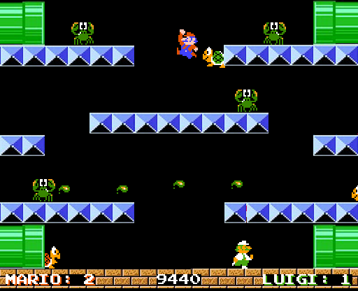
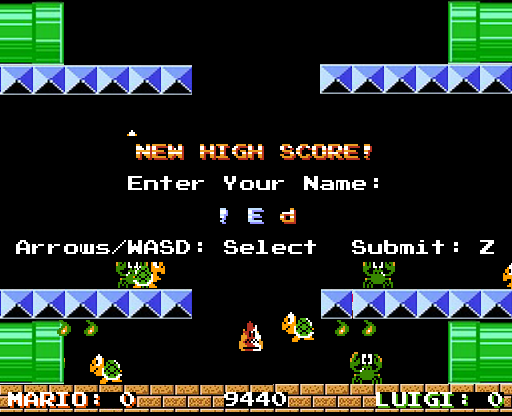
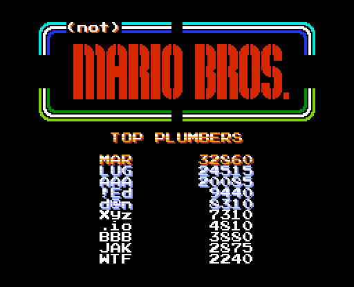

This repository contains the project files and complete source code for (not) Mario Bros, a clone of the original game which was created for a first-year Games Programming assignment at Staffordshire University.

This project is being treated as complete and is made public as an archive of-sorts. **Please do not send pull requests to this repository!**

# About
This project is an attempt to clone the original Mario Bros. game using C++ and the SDL library. Among the game's features, the most distinct include multiple enemy types, each with unique behaviour, a local highscore table complete with 3-character name entry that is preserved between game sessions, and the option to play with a second player.

# Requirements
All of the following SDL2 libraries are needed in order for the game to run:
- [SDL2](https://www.libsdl.org/)
- [SDL_mixer](https://www.libsdl.org/projects/SDL_mixer/)
- [SDL_image](https://www.libsdl.org/projects/SDL_image/)

Ensure that you have both of all of these libraries and that they are both linked with the Visual Studio project and added to the include paths/directories of the project.

# Screenshots

